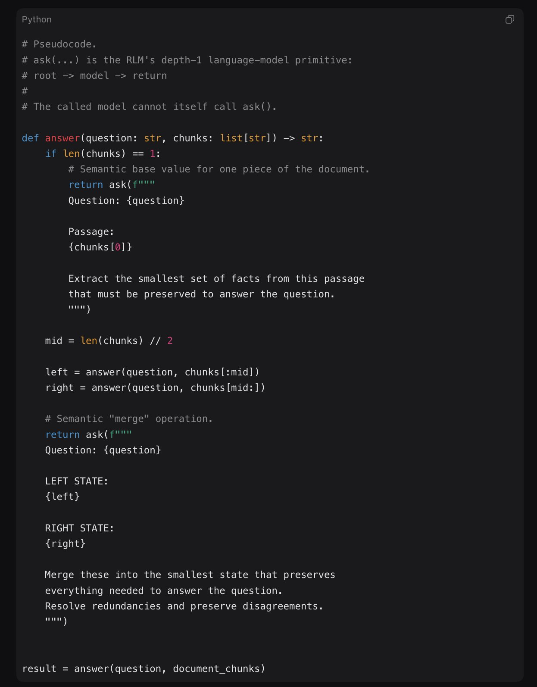
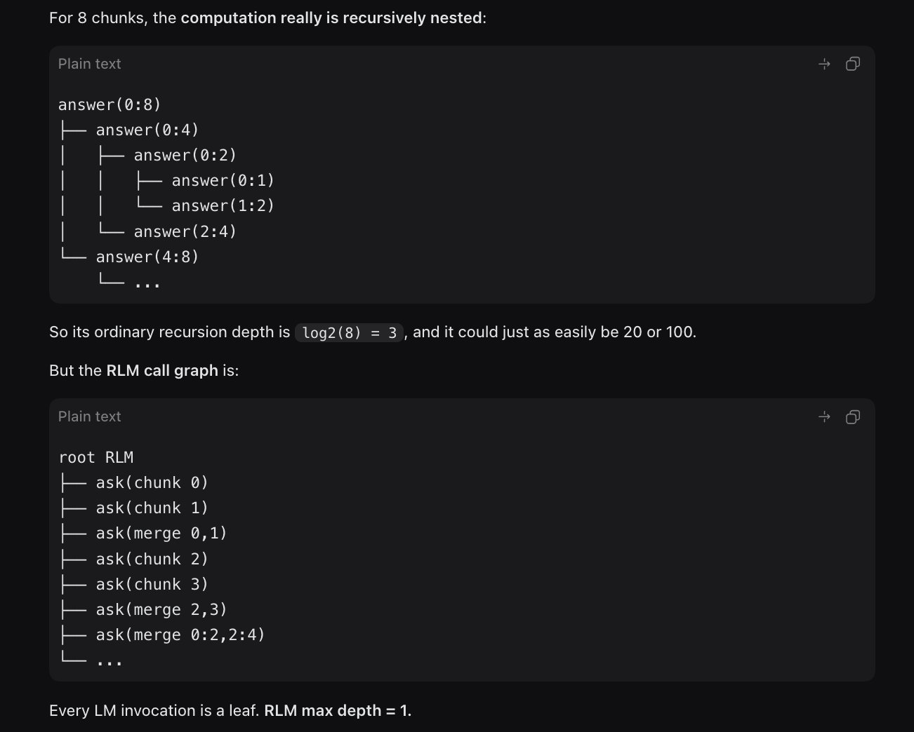
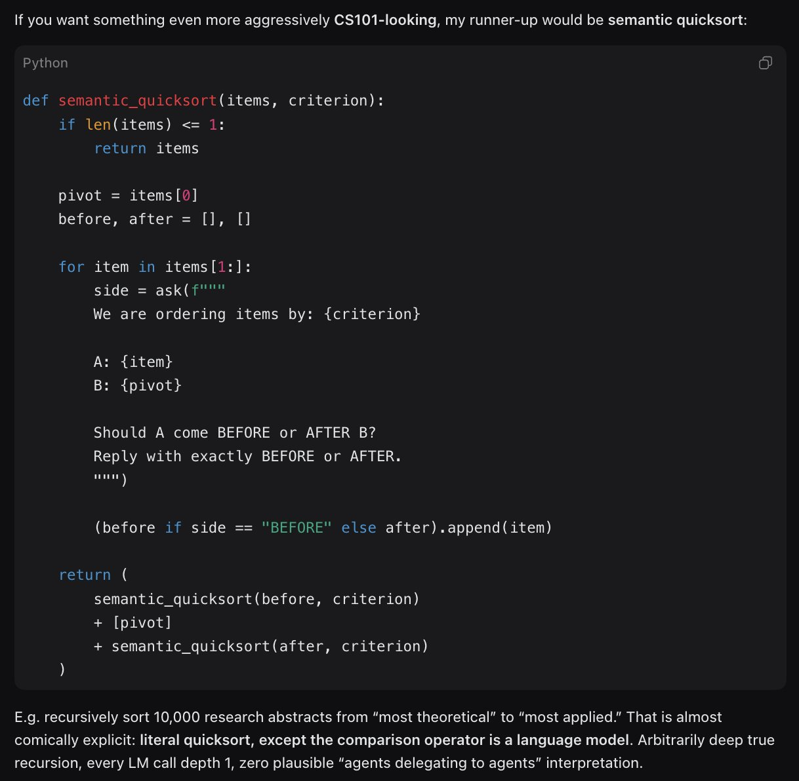

# Thread by @willccbb

Source post: https://x.com/willccbb/status/2085469602017161229

## 1. 2026-08-06T20:54:33.000Z https://x.com/willccbb/status/2085469602017161229

RLMs can very much do true recursion at depth=1 :)

because you're in a REPL, you can write *real recursive programs* that *call subagents* and still not need "subsubagents" anywhere. 

claude code can't do this -- you'd have to write a program in a file that execs "claude -p" https://t.co/SDV6k8NcmP

Links:
- https://x.com/willccbb/status/2085469602017161229/photo/1
- https://x.com/willccbb/status/2085469602017161229/photo/1
- https://x.com/willccbb/status/2085469602017161229/photo/1

### Attached images







### Image transcription

#### Recursive divide-and-merge

```python
# Pseudocode.
# ask(...) is the RLM's depth-1 language-model primitive:
# root -> model -> return
#
# The called model cannot itself call ask().

def answer(question: str, chunks: list[str]) -> str:
    if len(chunks) == 1:
        # Semantic base value for one piece of the document.
        return ask(f"""
        Question: {question}

        Passage:
        {chunks[0]}

        Extract the smallest set of facts from this passage
        that must be preserved to answer the question.
        """)

    mid = len(chunks) // 2

    left = answer(question, chunks[:mid])
    right = answer(question, chunks[mid:])

    # Semantic "merge" operation.
    return ask(f"""
    Question: {question}

    LEFT STATE:
    {left}

    RIGHT STATE:
    {right}

    Merge these into the smallest state that preserves
    everything needed to answer the question.
    Resolve redundancies and preserve disagreements.
    """)

result = answer(question, document_chunks)
```

#### Recursion tree and RLM call graph

For 8 chunks, the computation really is recursively nested:

```text
answer(0:8)
├── answer(0:4)
│   ├── answer(0:2)
│   │   ├── answer(0:1)
│   │   └── answer(1:2)
│   └── answer(2:4)
└── answer(4:8)
    └── ...
```

So its ordinary recursion depth is `log2(8) = 3`, and it could just as easily be 20 or 100.

But the RLM call graph is:

```text
root RLM
├── ask(chunk 0)
├── ask(chunk 1)
├── ask(merge 0,1)
├── ask(chunk 2)
├── ask(chunk 3)
├── ask(merge 2,3)
├── ask(merge 0:2,2:4)
└── ...
```

Every LM invocation is a leaf. RLM max depth = 1.

#### Semantic quicksort

If you want something even more aggressively CS101-looking, my runner-up would be semantic quicksort:

```python
def semantic_quicksort(items, criterion):
    if len(items) <= 1:
        return items

    pivot = items[0]
    before, after = [], []

    for item in items[1:]:
        side = ask(f"""
        We are ordering items by: {criterion}

        A: {item}
        B: {pivot}

        Should A come BEFORE or AFTER B?
        Reply with exactly BEFORE or AFTER.
        """)

        (before if side == "BEFORE" else after).append(item)

    return (
        semantic_quicksort(before, criterion)
        + [pivot]
        + semantic_quicksort(after, criterion)
    )
```

E.g. recursively sort 10,000 research abstracts from “most theoretical” to “most applied.” That is almost comically explicit: literal quicksort, except the comparison operator is a language model. Arbitrarily deep true recursion, every LM call depth 1, zero plausible “agents delegating to agents” interpretation.

## 2. 2026-08-06T22:24:18.000Z https://x.com/willccbb/status/2085492186662236390

@ButcherBradley breaks the rules for subscription usage haha

## 3. 2026-08-06T22:29:06.000Z https://x.com/willccbb/status/2085493394726629714

@olliecrosen yes! and we support bidirectional comms between subagents + parents :)

## 4. 2026-08-06T23:37:35.000Z https://x.com/willccbb/status/2085510629276991522

@llllvvuu in prime-agent we get a handle for the child agent, child gets a parent handle, both can send bidirectional messages which enter their context queue (just like user messages)

## 5. 2026-08-07T01:28:03.000Z https://x.com/willccbb/status/2085538428784132602

@llllvvuu the return isn't the response, it's a handle/id for the subagent, returns instantly

all agents are parallel/async, no blocking
